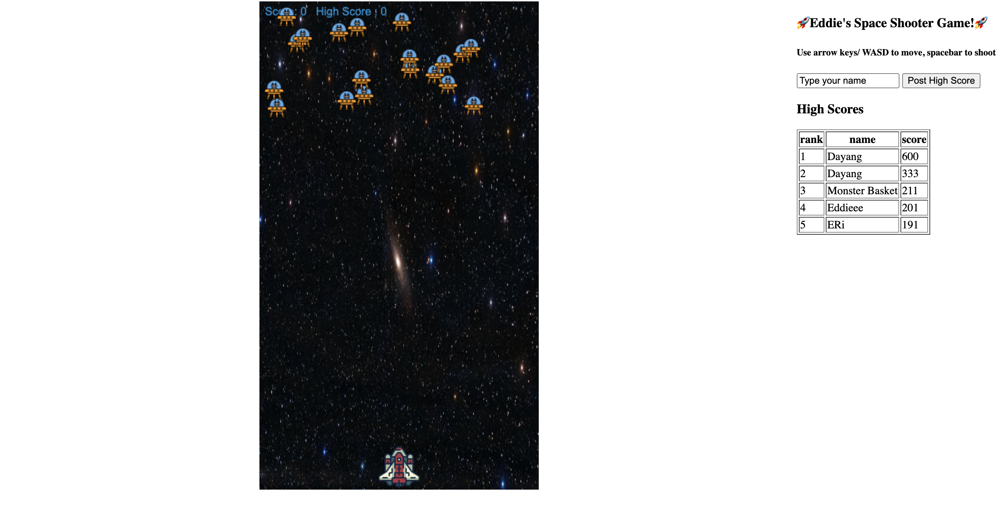

# javascript-project-space-shooting-game
### JavaScript Project
## link : <a href="https://justeddie.github.io/javascript-project-space-shooting-game/">Space Shooter Game🚀</a>
(last updated : 11/08/22)
### ⚡️ Used Programs ⚡️
### 💻 Used Stacks 💻

#### APIs
* <a href="https://developer.mozilla.org/en-US/docs/Web/API/Canvas_API">Canvas_API</a>
* <a href="https://jsonbin.io/app/dashboard">JSONBin.io</a>

#### It looks Like : 

### 🗝 Key Skills 🗝
* Design and architect features across frontend and backend
* Communicate and collaborate in a technical environment
* Integrate JavaScript and 3rd Party APIs
* Debug issues
* Refactor code

